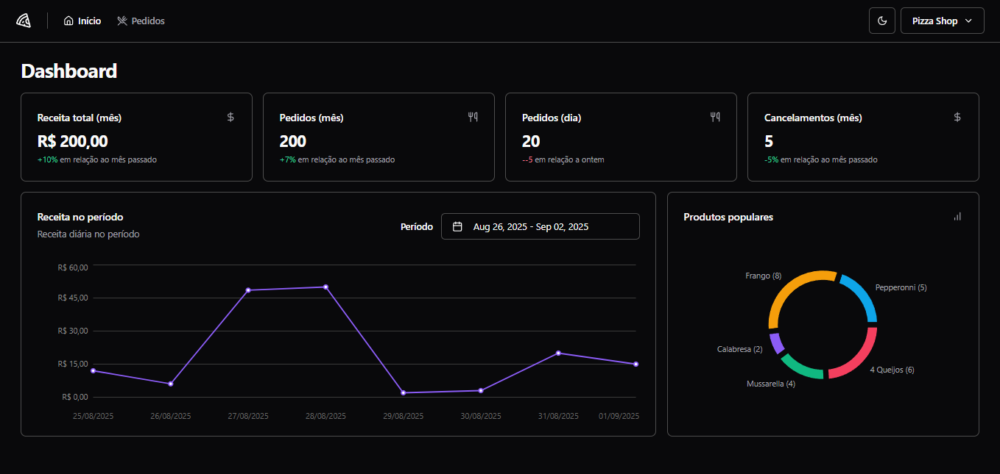
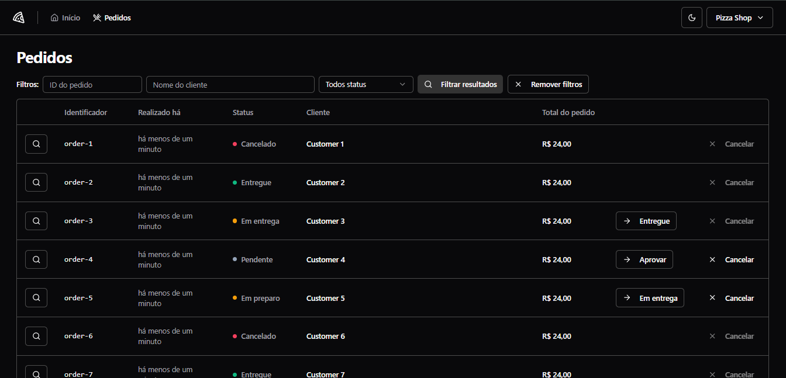
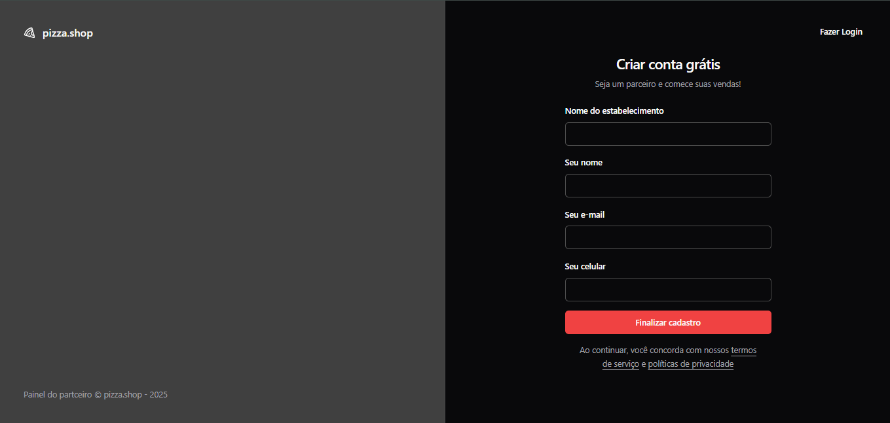

Pizza Shop

This was the project developed in level 04 of Rocketseat's React course.

## Table of contents

- [Overview](#overview)
  - [Screenshots](#screenshots)
- [How to Run the Project](#how-to-run-the-project)
- [Developed with](#developed-with)
- [Author](#author)

## Overview

This project is a pizza restaurant management application (an admin dashboard). It allows users to register a new pizzeria, log in, view orders, filter them by name or status, edit pizzeria information, and update order statuses to delivered, canceled, in preparation, or out for delivery.

During the development process, I practiced key concepts such as communicating with APIs through HTTP requests and implementing tests in frontend applications.

### Screenshots

#### Dashboard screen



#### Orders screen



#### Sign Up screen



## How to Run the Backend (API)

To run the backend locally, follow these steps:

1. Clone the repository:
   ```bash
   git clone "https://github.com/rocketseat-education/pizzashop-api.git"

2. Start Docker:
   ```bash
   Open Docker Desktop (Windows/macOS) or ensure the Docker daemon is running (Linux).

3. Start the services with Docker Compose:
   ```bash
   docker compose up -d

4. Run the server with Bun:
   ```bash
   bun install
   bun dev

## How to Run the Project (Frontend)

To run the project locally, follow these steps:

1. Clone the repository:
   ```bash
   git clone "https://github.com/davsoliveira/pizzashop-web"

2. Navigate to the project folder:
   ```bash
   cd pizzashop-web

3. Install the dependencies:
   ```bash
   npm install

4. Start the development server:
   ```bash
   npm run dev

## Developed with

- Typescript 
- React
- API
- Tailwindcss
- React Query
- Vitest
- Shadcn/ui
- Mock Service Worker (MSW)
- Playwright
- Axios
- React Router DOM

## Author

- GitHub - [davsoliveira](https://github.com/davsoliveira)
- My portfolio - [Davi Oliveira](https://davsoliveira.github.io/portfolio/)